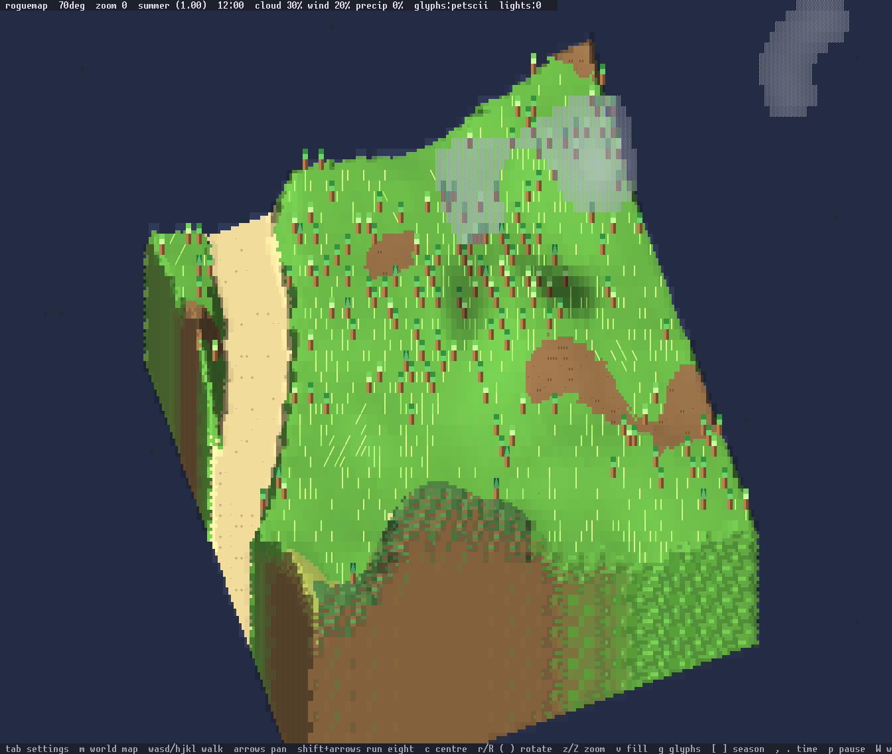
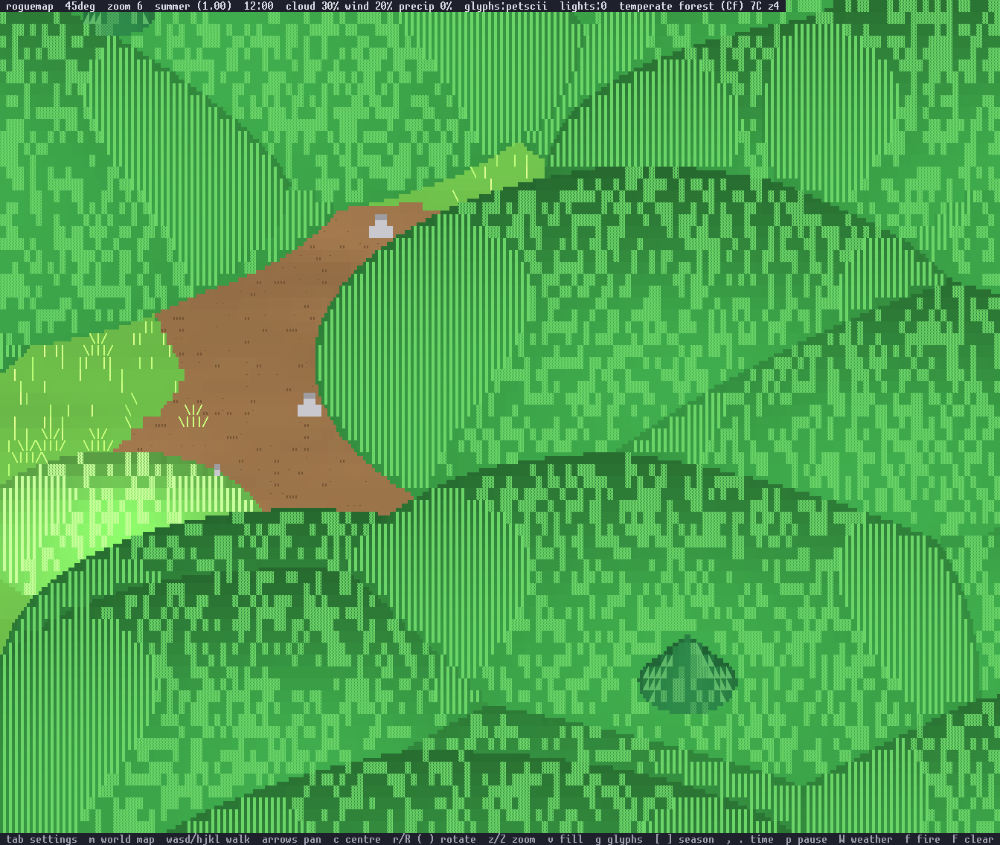

# roguemap

An isometric, height-mapped terrain renderer for the terminal. Terrain is
drawn by inverse projection: every screen cell walks down the height column
under it until it meets a tile top or a cliff face, so the camera can sit at
any angle. Cells on a boundary between two surfaces are supersampled 2x3 and
drawn with a sextant glyph and two colours. Sprites are billboards drawn
back to front with a depth test. A lighting pass then applies ambient sky
light, a sun shadowed by drifting clouds, and point lights such as
campfires. Seasons are
palette swaps on the unlit colour. Glyphs come from a switchable tileset:
plain ASCII, or PETSCII-style shapes from the Unicode Symbols for Legacy
Computing block.

## Screenshots

Rendered by `make screenshots` with the canonical snapshot pipeline.

| | |
|---|---|
|  The island view |  Rotated 25 degrees off compass |
|  Filled world at 4x1 |  Encounter zoom at 16x4 |
|  Night, campfire and lit windows |  Winter after two days of storm |
|  Above the clouds at the smallest zoom |  Steppe with adobe houses |
|  World map, large extent |  The ASCII glyph set |

## Run

```
cargo run --release -- [seed] [size]
```

Defaults are seed 7 and a 32x32 map. The starting zoom is the largest at
which the whole map fits the window; larger maps or smaller windows pan.
Anything from 80x25 upward works.

## Keys

The table follows the binding table in `src/input.rs`, which also generates
the help line at the bottom of the screen.

| Key | Action |
|---|---|
| `Tab` or `o` | open the settings window |
| `m` | open the world map |
| `w a s d` or `h j k l` | walk the player; the camera follows |
| arrows | pan by one tile |
| `c` | centre on the player |
| `r` / `R` | rotate a quarter turn about the screen centre |
| `(` / `)` | rotate five degrees |
| `z` / `Z` | zoom in / out through seven tile sizes, 2x1 to 16x4 cells |
| `v` | toggle island / filled world view |
| `g` | toggle PETSCII / ASCII glyphs |
| `[` / `]` | step the season by a quarter |
| `,` / `.` | step the clock by an hour |
| `p` | pause or resume the clock (a day is ten minutes by default) |
| `W` | cycle weather: auto, clear, cloudy, rain, storm |
| `f` | light a campfire at the screen centre |
| `F` | put out all fires |
| `H` | toggle the HUD |
| `q` or `Esc` | quit |

`Ctrl-C` quits from any mode. In the world map, arrows or `w a s d` /
`h j k l` move the cursor, `z` / `Z` change the extent, `Enter` or `t`
teleports, and `m`, `Esc` or `q` close it. In the settings window, up and
down (or `k` / `j`) pick a row, left and right (or `h` / `l`, `Enter`,
space) change it, and `Esc`, `Tab` or `q` close it.

## Settings

`Tab` opens a modal window over the scene. Up and down pick a row, left and
right change it, `Esc` closes. Every row also has a shortcut key.

| Setting | Values |
|---|---|
| Traversal | screen space (a key moves the figure that way on screen) or map axes |
| World view | island (a bounded map floating in the sky) or filled (terrain in every direction) |
| Glyphs | petscii or ascii |
| HUD | shown or hidden |
| Clock | running or paused |
| Weather | auto, clear, cloudy, rain, storm |
| Wind | auto, calm, breeze, windy, gale |
| Day length | 2 minutes, 10 minutes (default), 1 hour, 24 hours |
| Cloud layer | shown or hidden |
| Antialias | on or off (PETSCII glyphs only) |

The settings table in `assets/settings.toml` drives the window; each row
names its shortcut key, and the scene binding table in `src/input.rs`
mirrors it (a test keeps the two in step).

## Assets

Everything that describes a thing in the world (biomes, species, materials,
props, building kinds, creatures, surfaces, lights, settings rows, glyph
sets and hand-drawn sprites) is a TOML or text file under `assets/`,
embedded into the binary at build time. Set `ROGUEMAP_ASSETS=<dir>` to load
the same layout from disk instead, with no rebuild; a missing directory or a
bad row is an error naming the file and row. `make assets-export` writes
the embedded set to `./assets-export` as a starting point. The layout and
the art format are in [docs/assets.md](docs/assets.md), every row property
in [docs/properties.md](docs/properties.md), and the decision in
[ADR-001](docs/adr/ADR-001-assets-as-files.md). The crate is a library plus
two binaries: `roguemap` (the game) and `roguemap-edit` (the editor of
ADR-003, a stub for now).

## World

Terrain is a pure function of position and seed, generated on demand in
32x32 chunks. A slow continental field sets oceans, plains and ranges over
hundreds of tiles; local noise adds hills; rivers follow the mid contour of
another slow field. The island view bounds it to the map size; the filled
view lets it run in every direction.

Climate is temperature (a latitude-like field minus a lapse rate with
height) and precipitation. A simplified Köppen scheme in `src/biome.rs` maps
the pair to a biome, and the biome table names ground colour, tree density,
weighted species and building material. Going uphill in one region passes
from broadleaf forest to conifers to scrub to snow.

## Weather

Cloud cover, wind speed and direction, and precipitation drift along slow
noise on the day clock, or follow the presets in settings. Wind moves the
clouds, stirs trees through a gust field, drives the grass and raises
whitecaps. Precipitation accumulates per temperature band as snowpack or
wetness and melts or dries with warmth and sun.

At the two smallest zooms the view is above the clouds. Each screen cell
samples the cloud field where a ray from a virtual camera meets the cloud
plane, so panning moves clouds faster than the ground by C/(C - H), and the
shadow of each cloud lies along the sun direction by the altitude over the
tangent of the sun's elevation. Precipitation is drawn beneath the layer.

## World map

`m` plots biomes top-down at three extents (1, 4 or 16 tiles per column).
The header names the biome, temperature and height under the cursor; `Enter`
teleports the player there.

## Level of detail

Every zoom level carries its own sprite tier. Trees are generated
procedurally per tier: a single glyph at 2x1, a small pine at 4x1, layered
conifers and broadleaf canopies twenty-odd cells wide at 16x4. The player is
`@` at the overview and a nine-row figure at the largest zoom.

## Headless snapshots

```
roguemap --snap WIDTH HEIGHT out.cells key=value...
```

Keys: `seed`, `size`, `fill` (1 for the filled world), `cx`, `cy` (tile to
centre on), `zoom`, `rot` (quarter turns), `deg` (degrees), `t` (animation
time), `tod`, `season`, `cover`, `wind`, `precip` (0..1), `simdays` (run a
storm that many days first), `glyphs` (petscii or ascii), `player` (1),
`fire` (1 for a campfire at the centre), `hud` (0 or 1), `popover` (1),
`worldmap` (1) with `scale`, and `frames` (N, to time rendering). The output
lists one cell per line as codepoint and foreground and background colour;
`tools/cells2png.py` renders it with the Unscii font.

## Canonical look

The snapshot renderer is the reference for how the game should look.
`tools/cells2png.py` draws the cell dump with Unscii 16 at exactly 16 pixels,
so every cell is 8x16 pixels with no smoothing and the 24-bit colours come
straight from the cell buffer. `make screenshots` and `make snap` produce
that look.

A terminal emulator matches it when its font is Unscii at a pixel height of
16, its line spacing is zero, font antialiasing is off, and bold does not
brighten colours. `./term.sh` opens Konsole configured that way, deriving
the point size from the screen DPI (12 points at 96 DPI). Any other emulator
with the same font settings will render the same pixels.

## Fonts

The PETSCII tileset needs a font covering U+1FB00 to U+1FBFF. Unscii 16 Full
and Adwaita Mono both do; Konsole falls back to them for missing glyphs.
