# Spike: the world as a sphere

A spike, not a decision. The code is on `spike-spherical-world` and is
not for merging; its product is this note. The question started as
"can the world be a sphere" and ended, through three reframings by the
owner, as "can the sandbox sit on a 12,000 km sphere and show a
horizon". The answer to the last is yes, for one subtractive term on
the height field, a fog distance forty times today's, and a far tier of
banded haze — built here, 2.6 ms and one ray a screen column — that
issue #36 has to make worth looking at.

## The owner's words

"maybe we project onto a spherical world rather than a flat world";
"actual horizon scale vistas would be really nice ... a 12,000 km sphere
would be nice"; "any 'world' where one might play an rpg in is really
just one small sandbox. why not locate that sandbox inside the size of
something of the real world?"; "we don't need pixel perfect. we're
gazing into a terminal, and every character glyph is a type of greeble".

## What was tried

`Scene` gained `curvature` (`1 / 2R`, zero for a flat world) and
`tangent` (the viewer's ground point). The raster's terrain samplers
subtract `curvature * d^2` from the field, `d` metres from the tangent
point, after the sea-level clamp so the sea sags with the ground. The
perspective march runs to `Scene.far` whether or not the ray ever
crosses the height grid; beyond the grid it samples `Map::height_smooth`
pointwise and meets no geometry, and off a bounded map it meets the sea
bed. The grid's reach is capped at 120 m (`Scene.grid_far`) so a 4.6 km
far distance does not build a 4.6 km grid. A statistical far field
(`Scene.far_stat`) answers a cell beyond a crossover distance from a
coarse field, `Map::coarse_height` (the control noise alone, the local
octaves at their mean, no rivers), at one sample per step with no
bisection and no gradient. Counters record segments per ray and, per
screen row, the rays and segments the row spent. Snapshot keys:
`sphere=R gridfar= maxstep= minstep= stat= rows=1 aa=0`, the last
turning the sextant antialiasing off. A second round added the far tier
of section 3: `band=D` renders from `fog=` out to `D` as a skyline per
screen column over a banded haze, with `haze=` for the haze scale.

Nothing else moved: no camera change, no grid change, no new coordinate
system.

The spike's frames are not main's, with the curvature at zero. Two
golden frames differ — `steppe` in 4.8% of its cells and `shoulder` in
3.8% — because the samplers now answer off the grid where they used to
clamp to its edge, and the perspective march runs to `Scene.far` rather
than to the grid's span. The term is a no-op at zero curvature; the
plumbing around it is not, and `make check` is red on this branch for
that. A real implementation puts the sag in `HeightGrid::build`, where
the grid's edge behaviour need not move at all (section 4).

## 1. The horizon comes out of the walk unchanged

The term works. On the yardstick fixture from a first-person eye at
`z = 3 + 1.7 m` with `sphere=6000000 fog=4600 fogmode=never`, the ground
ends at row 35.6 of 71; the level row is 35.5 and the predicted drop of
the horizon below it is `4.7 * 72.7 / 4500 = 0.075` rows. The 1:1
isometric yardstick is bit-identical with and without the term; the 1:8
overview differs in 267 of 11,928 cells because the sea surface sits
exactly on the walk's height lattice at 0.0 and a 1 mm sag moves those
hits by one sample.

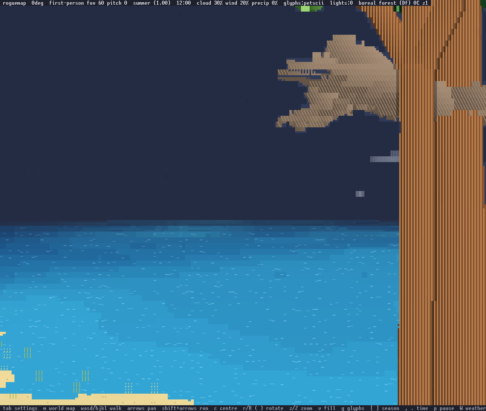

The open-sea shore at `cx=-2552 cy=1544` on seed 7 as it renders today:
the water ends at 120 m, three and a half rows under the level row, with
sky in between.

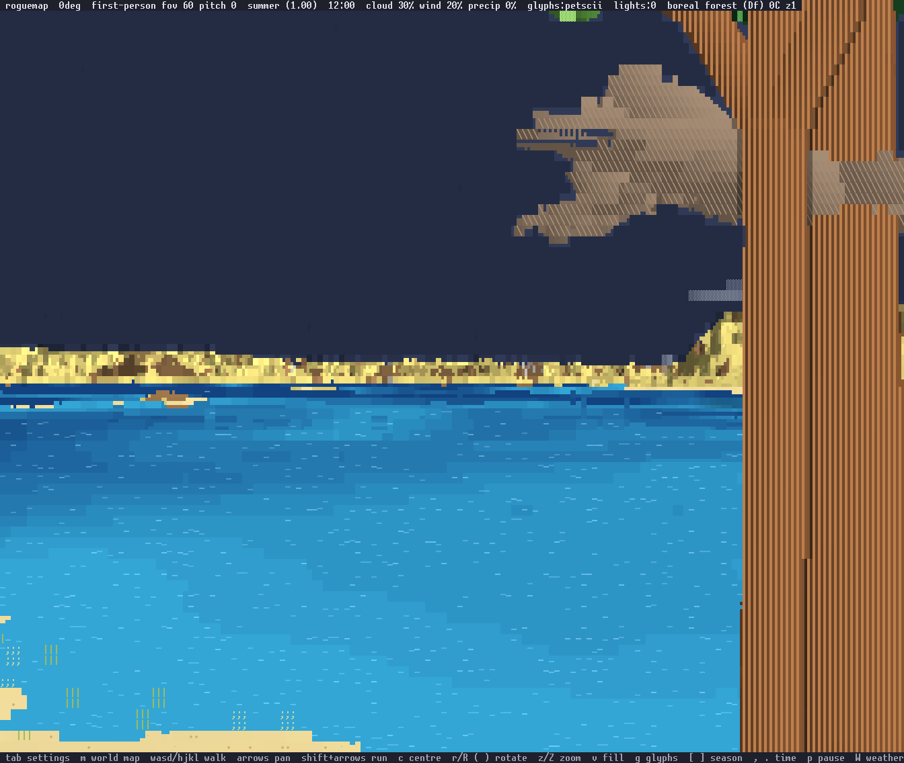

The same eye on the 6,000 km sphere, marched to 4.6 km: the water runs
to a coast 1.6 km out and the sky line sits at the level row.

What the term does not do is anything the eye can see at this
resolution. At 168x71 with a 60 degree field the screen is 72.7 rows per
radian, so the sag angle `d / 2R` reaches one row at `d = 165 km`. From
a 1.7 m eye the horizon is 4.5 km and the sag there is 0.027 rows; from
the world's highest tile (119.7 m, `-2912, -3000`) it is 38 km and 0.23
rows. The flat world marched to the same distance differs from the
sphere by 153 cells on the fixture and by nothing a reader can point
to on the peak. On a 6,000 km sphere the horizon is a fog-distance
question: today's `CLEAR_VISIBILITY` of 120 m is what hides it, since
from eye height the ground beyond 120 m is a band under two rows tall
and the fog fades it to sky. The term's job is to bound the walk where
the geometry bounds it, so an elevated eye sees farther than a low one
for a physical reason and a hill beyond the horizon shows only its top.

The arithmetic in the brief holds: `sqrt(2 * 4235.3 * 1.7) = 120.0`,
so a 4.2 km planet is the one whose horizon from eye height is today's
visibility cutoff. It is the wrong direction to go: what the owner wants
is the reverse, an Earth-sized sphere and a visibility of kilometres.

On a 500 m toy the term is the look. The sag angle reaches a row at
13.75 m, the horizon from a standing eye is 41 m, and a hill 80 m off
sinks six metres:

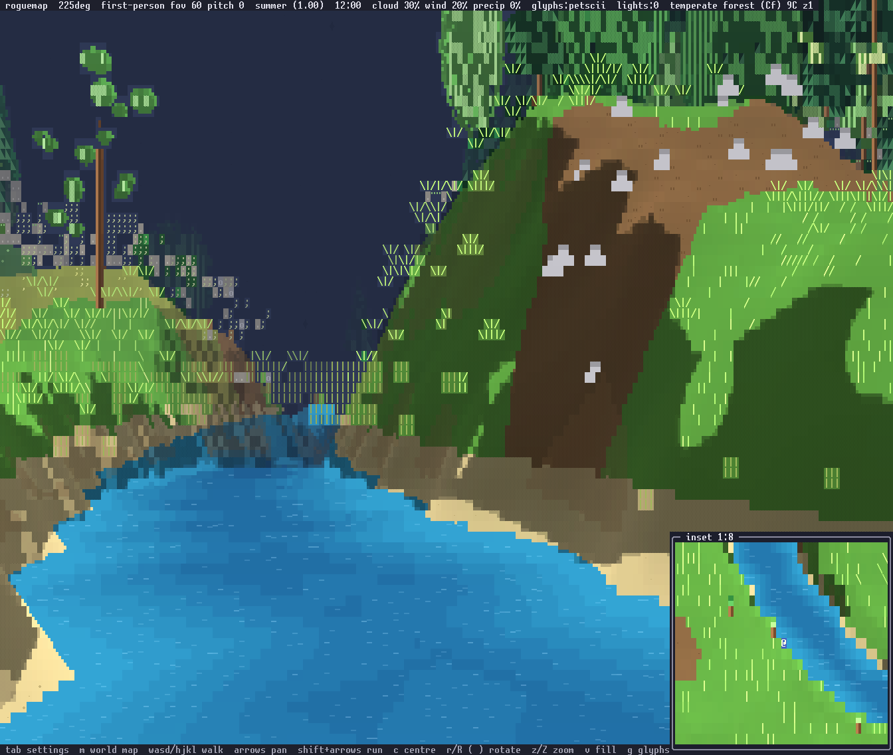

The gallery's shore on a 500 m sphere; the same view on the 6,000 km
one is the flat frame to the cell.

## 2. Cost

Single-threaded, `frames=20`, best of three, this box. The renderer uses
one core of thirty-two and a ray per cell is independent, so the multiple
over today's frames is the figure that survives a parallel walk. From the
same run, at 168x71 and at 120x40: the 1:1 isometric stand costs 5.5 and
2.3 ms, the chase view 23.9 and 10.5. The frame budget is 16 ms.

Five legs per view: today's 120 m fog; a fixed 2 m step; today's step
rule with its 4 m cap; the step growing with distance, `2t / rows`
uncapped; and the growing step with a statistical far field past a
crossover. Samples per ray are the frame average. "Peak row" is the
samples a ray takes on the busiest screen row.

Four views, on seed 7 with `fill=1 t=3 tod=12 inset=0`:

| view | eye | arguments |
|---|---|---|
| sea | 1.7 m, level, 1.6 km of open water ahead | `camera=first-person cx=-2552 cy=1544 deg=-45` |
| peak | 121.4 m, three degrees down | `camera=first-person cx=-2912 cy=-3000 deg=0 pitch=3` |
| level | 121.4 m, level, over the interior | `camera=first-person cx=-2912 cy=-3000 deg=135 pitch=0` |
| stand chase | 12 m back, thirty degrees down | `camera=chase cx=470 cy=-300 deg=-45` |

The sphere legs add `sphere=6000000 fogmode=never` with `fog=` for the
far distance, `minstep=2 maxstep=2` for the fixed step, `maxstep=100000`
for the growing one, and `stat=` for the far field.

168x71:

| view | ms | samples/ray | peak row |
|---|---|---|---|
| sea, today, 120 m | 25.8 | 44 | 64 |
| sea, 4.6 km, fixed 2 m step | 94.7 | 62 | 412 |
| sea, 4.6 km, today's step (4 m cap) | 69.1 | 65 | 217 |
| sea, 4.6 km, growing | 45.7 | 47 | 100 |
| sea, 4.6 km, growing, statistic past 120 m | 35.6 | 49 | 106 |
| sea, 4.6 km, growing, statistic past 300 m | 39.7 | 49 | 106 |
| sea, 4.6 km, growing, statistic past 600 m | 41.9 | 48 | 100 |
| sea, 4.6 km, growing, statistic past 1 km | 42.8 | 48 | 100 |
| sea, 4.6 km, growing, statistic past 2 km | 45.6 | 47 | 100 |
| peak, today, 120 m | 16.4 | 23 | 46 |
| peak, 40 km, fixed 2 m step | 69.8 | 48 | 1696 |
| peak, 40 km, today's step | 48.1 | 40 | 849 |
| peak, 40 km, growing | 25.3 | 24 | 70 |
| peak, 40 km, growing, statistic past 120 m | 21.2 | 26 | 58 |
| peak, 40 km, growing, statistic past 300 m | 22.9 | 26 | 54 |
| peak, 40 km, growing, statistic past 1 km | 24.2 | 24 | 72 |
| peak, 10 km, growing | 25.1 | 24 | 65 |
| level, today, 120 m | 10.0 | 31 | 45 |
| level, 40 km, fixed 2 m step | 186.3 | 87 | 258 |
| level, 40 km, today's step | 110.1 | 53 | 139 |
| level, 40 km, growing | 53.8 | 23 | 33 |
| level, 40 km, growing, statistic past 120 m | 26.2 | 34 | 59 |
| level, 40 km, growing, statistic past 300 m | 29.5 | 33 | 59 |
| level, 40 km, growing, statistic past 1 km | 46.7 | 23 | 38 |
| level, 4.6 km, growing | 53.5 | 23 | 33 |
| stand chase, today | 23.9 | 49 | 81 |
| stand chase, 4.6 km, growing, statistic past 300 m | 24.2 | 49 | 81 |
| yardstick 1:1 isometric, flat and sphere | 5.5 / 5.8 | 13 | — |

120x40:

| view | ms | samples/ray | peak row |
|---|---|---|---|
| sea, today, 120 m | 12.1 | 35 | 55 |
| sea, 4.6 km, fixed 2 m step | 60.9 | 80 | 469 |
| sea, 4.6 km, today's step | 40.3 | 66 | 247 |
| sea, 4.6 km, growing | 22.1 | 38 | 78 |
| sea, 4.6 km, growing, statistic past 120 m | 16.9 | 38 | 82 |
| sea, 4.6 km, growing, statistic past 300 m | 18.5 | 38 | 82 |
| sea, 4.6 km, growing, statistic past 600 m | 19.5 | 38 | 78 |
| sea, 4.6 km, growing, statistic past 1 km | 20.1 | 38 | 78 |
| sea, 4.6 km, growing, statistic past 2 km | 21.6 | 38 | 78 |
| peak, today, 120 m | 7.4 | 14 | 30 |
| peak, 40 km, fixed 2 m step | 31.2 | 38 | 438 |
| peak, 40 km, today's step | 21.3 | 28 | 231 |
| peak, 40 km, growing | 11.3 | 15 | 28 |
| peak, 40 km, growing, statistic past 120 m | 9.9 | 17 | 43 |
| peak, 40 km, growing, statistic past 300 m | 10.5 | 17 | 43 |
| peak, 40 km, growing, statistic past 1 km | 11.0 | 15 | 29 |
| peak, 10 km, growing | 11.3 | 15 | 28 |
| level, today, 120 m | 4.2 | 23 | 31 |
| level, 40 km, fixed 2 m step | 117.0 | 108 | 370 |
| level, 40 km, today's step | 66.0 | 62 | 189 |
| level, 40 km, growing | 26.0 | 18 | 28 |
| level, 40 km, growing, statistic past 120 m | 11.9 | 25 | 37 |
| level, 40 km, growing, statistic past 300 m | 13.4 | 24 | 36 |
| level, 40 km, growing, statistic past 1 km | 22.4 | 18 | 28 |
| level, 4.6 km, growing | 25.7 | 18 | 28 |
| stand chase, today | 10.5 | 36 | 62 |
| stand chase, 4.6 km, growing, statistic past 300 m | 10.7 | 36 | 62 |
| yardstick 1:1 isometric, flat and sphere | 2.3 / 2.4 | 14 | — |

The three numbers asked for, on the sea's horizon row: 412 samples a ray
at a fixed 2 m step, 100 with the step growing with distance, 106 with
the statistic past 120 m. The growing step is the whole saving in
samples: it is today's `2t / rows` rule with the 4 m cap removed, and it
makes distance logarithmic — 10 km and 40 km from the peak cost the same
frame. Off-grid samples cost more than on-grid ones, since they evaluate
seven octaves of noise pointwise where the grid interpolates a cached
lattice, and a marched terrain hit adds six bisection rounds and four
gradient taps; that, and the sub-rays along the new far edges, is the
rest of the gap between 25.8 and 45.7.

Against the 5.5 ms of the 1:1 stand, the growing step costs 8.3x on the
sea, 4.6x on the peak and 9.8x looking level from the peak. Against the
16 ms budget: 2.9x, 1.6x and 3.4x. At 120x40 the same views are 9.6x,
4.9x and 11.3x the 2.3 ms stand, which is 1.4x, 0.7x and 1.6x the budget,
and the statistic past 120 m puts the peak at 9.9 ms and the level view
at 11.9, leaving the sea at 16.9. Nothing with a kilometre horizon fits
16 ms at 168x71 on one core.

### Where the crossover falls

There is no crossover in cost. The statistic's saving grows the nearer
its crossover sits, all the way in: on the sea 10.1 ms at 120 m, 6.0 at
300 m, 3.8 at 600 m, 2.9 at 1 km and nothing at 2 km, of a 45.7 ms frame.
The peak saves 4.1, 2.4 and 1.1 ms at the same three near distances of a
25.3 ms frame. The crossover is a question about the picture, and section
3 answers it: on the sea the picture is the same wherever the crossover
sits, so it belongs at 120 m; on the peak and the level view the
statistic changes what the frame shows, and no setting is both cheap and
right. Section 3 is why: a crossover distance tunes a per-cell far field,
and the far field the owner specified is not per cell.

### Where the cost sits on the screen

Samples per ray by screen row, and each row's share of the frame's
segments (`rows=1`, one frame, 168x71):

| view | busiest ten rows | their share | samples/ray there | samples/ray elsewhere |
|---|---|---|---|---|
| sea, today | 5–14 | 18% | 40–62 | 13–64 |
| sea, 4.6 km, growing | 28–37 | 28% | 19–100 | 30–60 |
| peak, 40 km, growing | 31–40 | 35% | 10–70 | 15–44 |
| level, 40 km, growing | 36–45 | 39% | 17–26 | 17–33 |

Today's frame is flat: no row is more than 2.4% of the segments, and ten
rows of seventy-one hold 18% against the 14% an even spread would give.
The sphere concentrates it. On the sea the level row alone, row 35, is
6.5% of the frame, and the ten rows around it are 28%; samples per ray
climb from 30 at the bottom of the screen to 100 just above the level
row, where a ray runs the whole 4.6 km without meeting ground.

The peak and the level view invert the reading. Their samples per ray in
the busy band are the lowest on the screen — 10 to 26 — and the band is
still the most expensive part of the frame. The rays are what multiply.
A quiet row of the sea view marches 180 to 190 rays across 168 cells; a
horizon row marches a thousand. Every cell there is a boundary between
two visibly different surfaces, so the antialiaser supersamples it.

Turning the sextants off (`aa=0`) separates the two costs at 168x71:

| view | ms with sextants | ms without | rays |
|---|---|---|---|
| sea, today | 25.8 | 21.1 | 17,777 / 11,928 |
| sea, 4.6 km, growing | 45.7 | 30.3 | 20,755 / 11,928 |
| level, today | 10.0 | 7.4 | 9,276 / 5,880 |
| level, 40 km, growing | 53.8 | 23.5 | 24,318 / 5,880 |

The march itself, on the level view, goes from 7.4 ms to 23.5. The other
30 ms is the antialiaser, drawing four rays a cell over the half of the
screen the far field fills.

That 30 ms is not an optimisation waiting on today's frames. `aa=0` is a
key of this branch; the shipped binary ignores it and reaches the same
switch through the `antialias` setting. The antialiaser's cost tracks how
much of the screen is a boundary between two visibly different surfaces,
and on today's content that is a fifth of a perspective frame: 4.7 ms of
the sea view's 25.8 and 2.6 ms of the level view's 10.0. With a horizon
it is over half. The far band is a kind of content the antialiaser was
never designed against, and the cost arrives with it.

### The level view from a height

A free camera looking level from a height makes the horizon band half
the screen. The `level` view is that case within what this branch can
build — first-person on the world's highest tile with `pitch=0`, an eye
at 121.4 m, the horizon at 39 km, thirty-six of seventy-one rows below
the level row and every one of them far ground.

It is the worst case and it is well over budget: 53.8 ms at 168x71, 9.8x
the 1:1 stand and 3.4x the budget, and the fog distance barely enters it
— 4.6 km costs 53.5 and 40 km costs 53.8. Its cost is the ray count. The
sky half is free, since the eye sits above `grid.max_top` and an upward
ray returns before it marches; the ground half draws 24,318 rays over
5,880 cells.

What would pay for it, in the order the numbers rank them. The
antialiaser is 30 of the 53.8 ms, spending four rays a cell on one-cell
noise a reader cannot read; a far field with a coarser palette, or the
sextants off past a distance, takes the frame to 23.5 ms. The statistic
takes 53.8 to 26.2, by flattening the far field into fewer edges as much
as by skipping the bisection. Then the thirty-two cores. At 120x40 the
same view is 26.0 ms marched and 11.9 ms with the statistic, so the
small terminal already has a level horizon inside the budget.

That ranking is of ways to make a per-cell far field cheaper. Section 3
replaces the per-cell far field, and its floor — 17.7 ms of march at
168x71 with the sextants already off — is what the banded model has to
beat rather than what it has to accept.

## 3. The far field by eye

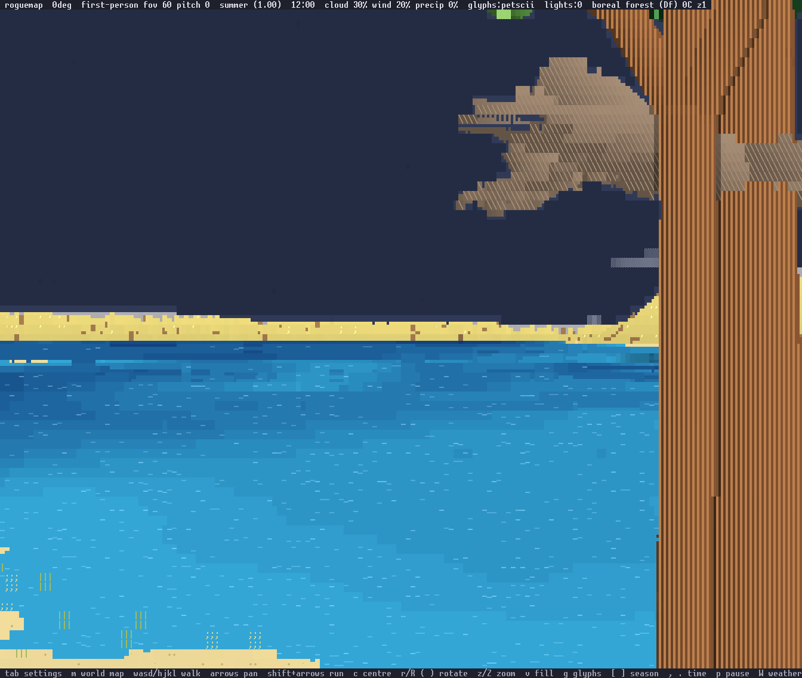

The sea with the statistic from 120 m: the far coast is a band of sand
with brown flecks, flatter than the marched coast's forest and cliffs,
and reads as a shore.

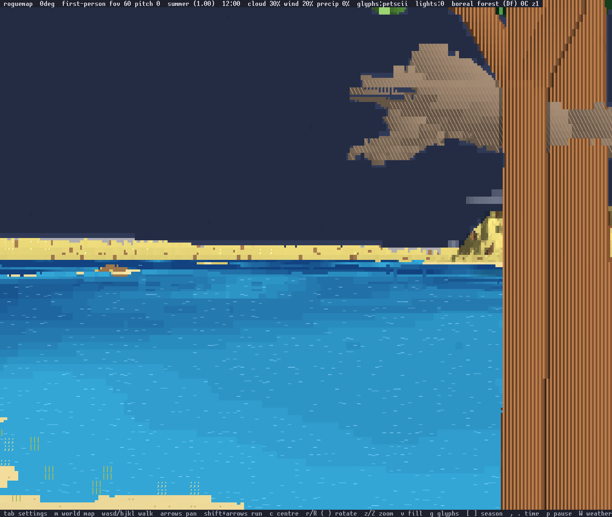

The other end of the crossover, the same view with the statistic from
1 km. It costs 7.2 ms more and 96% of its cells are the 120 m frame's.
Against the fully marched frame the two differ in 6.3% and 3.3% of cells,
at a mean colour distance of 3.3 and 1.9. On this view the crossover
belongs as near as it will go.

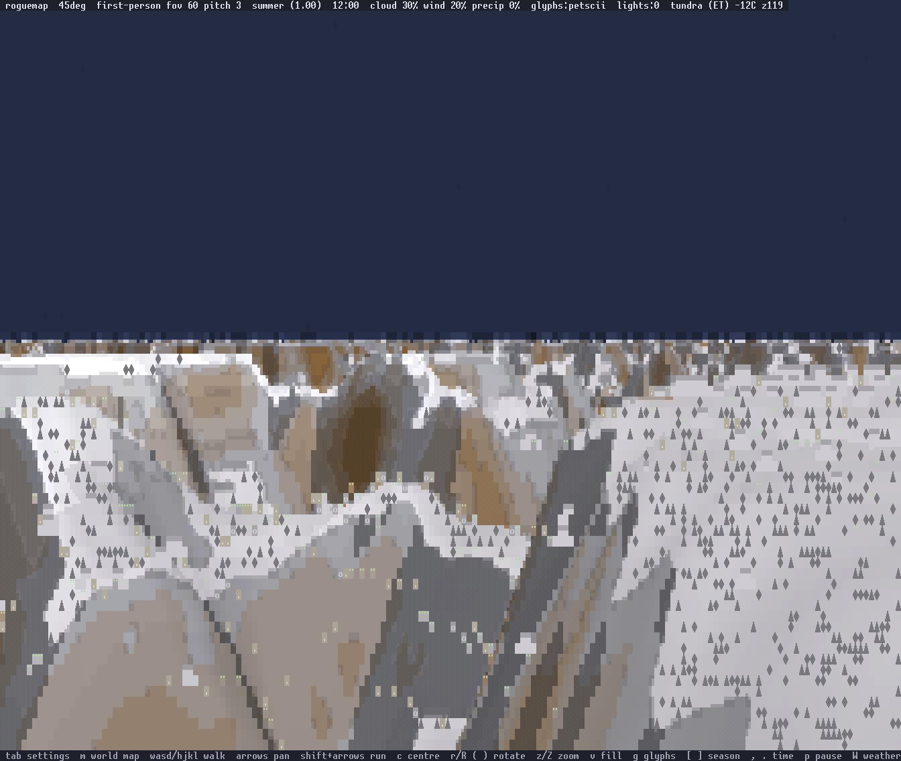

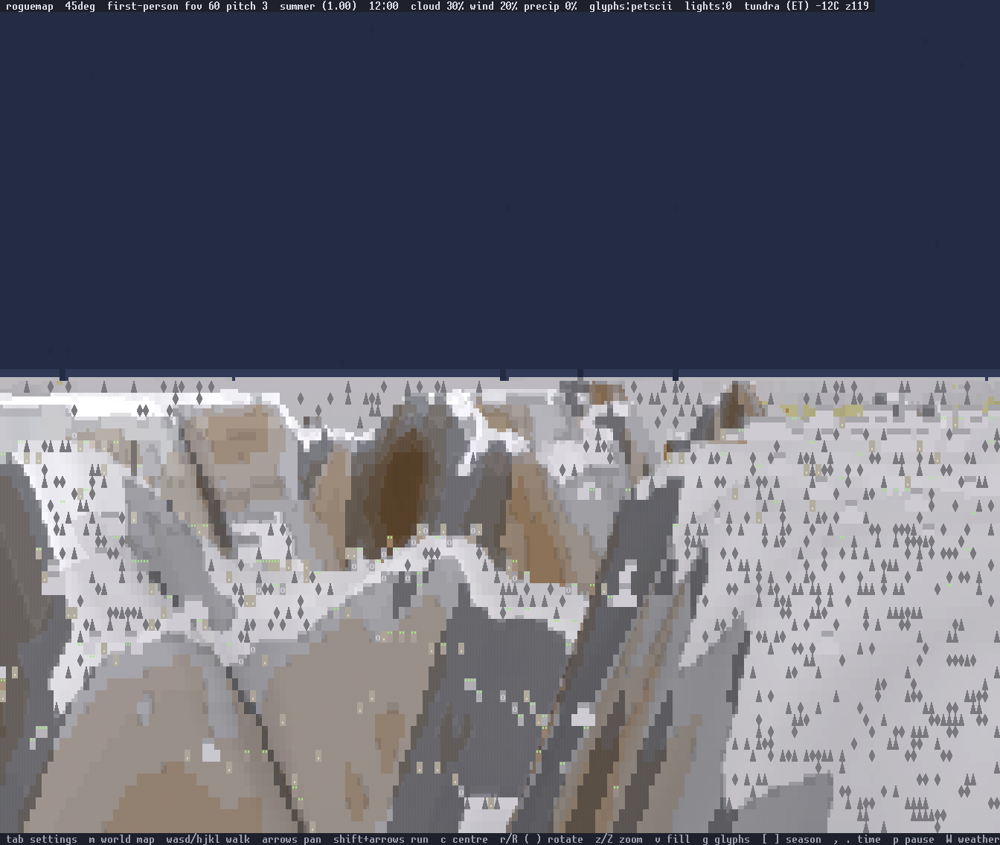

The peak marched to 40 km, and the same with the statistic from 300 m.
The marched skyline is ragged; the statistic's is a level pale band. The
coarse field has no relief shorter than its 570 m period, so a mountain's
silhouette is what the statistic loses. Past 1 km the statistic is
indistinguishable from marching.

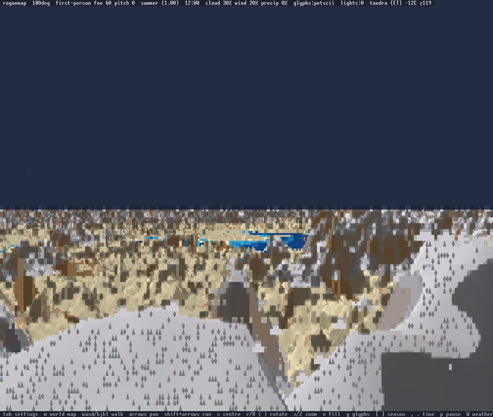

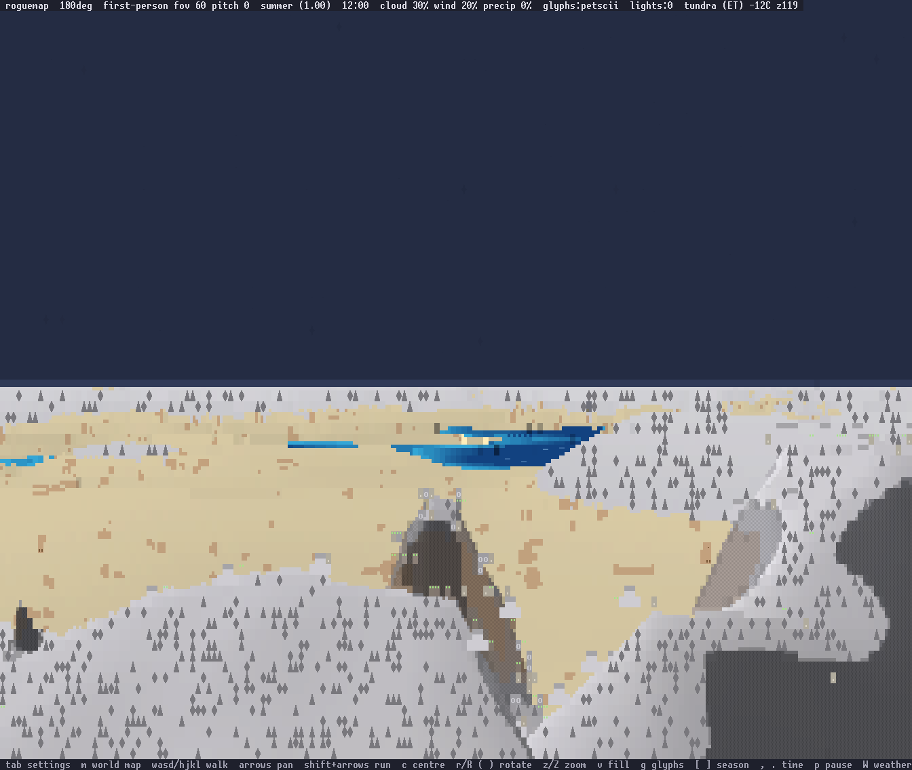

Looking level from 121 m, marched to 40 km and with the statistic from
120 m. Neither reads as landscape. The marched frame is a fizz of
one-cell speckle from the level row to the bottom of the screen, with the
lakes at twenty kilometres broken into blue dashes; the statistic is a
smear, three flat washes of sand and snow with a hard edge between them
and no relief at all. They differ in 25% of their cells at a mean colour
distance of 27, which is two pictures rather than two settings.

The failure is the resolution's. At 40 km a screen column is 275 m of
ground across, and the field has seven octaves of detail under it;
marching sees all of that and aliases, and the statistic sees none of it
and flattens. Both answer the same question, height per cell, and the
next section is the owner's answer that the question is wrong.

### What the far field should compute

The owner, on the renders above: "those test renders to the distance
only look 'bad' because we are rendering the landscape with the
incorrect frequency, and we're not using far distance LOD to our
advantage. looking at a far horizon of plains, the only thing we'd see
would be the horizon which could be made up of some colored bands and a
skymap, and the typical gradient one sees to the horizon."

The reference is a photograph of the Flint Hills of Kansas at sunset,
at `~/Downloads/Flint_Hills_of_Kansas_88d64cc8-7d05-4c08-8289-2393444fe5dc.jpg`.
It is not committed here: its licence is not ours to assume. Measured
off it, by band of screen height, with saturation on 0..255 and
horizontal contrast as the mean step between neighbouring 16-pixel
column means:

| band | share of height | saturation | horizontal contrast |
|---|---|---|---|
| sky | 27% | 101 | 2.08 |
| sky, the ninth just over the horizon | 9% | 70 | 1.96 |
| far ground, about 3 km to the horizon | 14% | 46 | 2.10 |
| middle ground | 19% | 54 | 4.78 |
| foreground, the nearest few hundred metres | 40% | 143 | 6.60 |

Distance compresses hyperbolically. The nearest few hundred metres are
40% of the frame and everything from 3 km to the horizon is 14%. The
per-row histogram of section 2 measures the same 14% of the screen from
the cost side: the busiest ten rows of seventy-one carry 28% of the sea
view's work. The far field is a handful of rows holding twice their
share of the frame's cost.

Inside those rows there is no texture. The far band's horizontal
contrast is 2.10 against the sky's own 2.08 and the foreground's 6.60 —
the far ground is as textureless as the air over it. Successive
ridgelines are horizontal strips separated by tone. Tree lines that
resolve individually at 1 km are one darker strip at 5 km.

Aerial perspective is the depth cue, and it is a collapse of saturation
rather than of brightness. Saturation runs 143, 54, 46 from foreground
to horizon, and the far band's mean colour, 108/111/128, sits within
twenty units of neutral where the foreground's 80/77/36 is strongly
yellow-green. Luminance does not collapse with it: the sun is on the
horizon in this photograph and the far ground is darker than the sky
above it. A far strip takes the sky's hue and its flatness. Whether it
also takes its brightness is the sun's business, not the distance's.

The sky carries its own gradient, palest at the horizon — saturation 70
in the ninth of the frame above the horizon line against 101 over the
whole sky. Half of why the horizon line reads at all is the sky's side
of it.

So the far field computes a skyline height per screen column and a
banded haze over it. At 168 columns that is 168 outward marches of the
coarse field, each wanting a maximum elevation angle rather than a hit,
against 11,928 cells each wanting a height.

### Three tiers, and two of them are already built

The owner, on how the distance divides: "swap out the close distance with
grassy clump greebles, middle distance with rendered hills, and far
distance with essentially proxy place holders and use a liberal high/true
color palette, and it would be quite plausable".

Close is glyph texture, the grass and scree greebles of `surface_glyph`.
Middle is the ray walk on real geometry. Both ship today. The far tier is
the proxy, and the work is that tier plus the two crossovers.

The palette is what makes the far tier drawable. `Terminal::flush` emits
`Color::Rgb` for foreground and background alike (`src/terminal.rs:141`),
so a cell carries two 24-bit colours and one glyph: 48 bits of colour
against 6.2 bits of glyph as this view actually draws it, 73 distinct
glyphs in the frame, or 8 to 9 bits for the whole repertoire. Colour is
between six-sevenths and seven-eighths of what a cell can say. In a flat
far strip the glyph says nothing at all, so out there colour is the whole
signal — and successive ridgelines differing by a few units of RGB is
exactly what 24-bit colour expresses and what the photograph shows.

### The far tier, built and measured

`band=D` builds it: the walk reaches `fog=`, and from there to `D` the
frame is one outward march of the coarse field per screen column for a
skyline elevation, then per cell the land's colour at the distance the
row implies, lerped into the sky by `0.92 * (1 - exp(-d / haze))`. The
boundary cell of each column takes a sextant, land over sky.

The far tier costs one ray per screen column and about two and a half
milliseconds, whatever the walk in front of it reaches (level view,
168x71, band out to 40 km):

| the walk reaches | no far tier | with it | the tier | rays added |
|---|---|---|---|---|
| 120 m | 10.4 | 13.0 | 2.6 | 168 |
| 300 m | 22.9 | 25.3 | 2.4 | 168 |
| 600 m | 52.3 | 53.9 | 1.7 | 168 |
| 120 m, at 120x40 | 4.2 | 5.6 | 1.4 | 120 |

168 rays on a 168-column screen, 120 on a 120-column one. The
specification and the measurement are the same number.

Against the two per-cell far fields on the same view at 168x71:

| far field | ms | rays |
|---|---|---|
| marched to 40 km, growing step | 54.0 | 24,318 |
| statistic past 120 m | 26.2 | 15,738 |
| statistic past 120 m, sextants off | 17.9 | 5,880 |
| **band tier, walk to 120 m** | **13.0** | **9,420** |
| today, no horizon at all | 10.4 | 9,252 |

A 40 km horizon costs 2.6 ms over a frame that has none, and the whole
frame is 13.0 ms against 54.0 marched. **This is the first configuration
in the spike that renders a horizon inside the 16 ms budget at 168x71**,
and at 120x40 it is 5.6 ms.

What dominates is no longer the far field. It is how far the middle tier
reaches: 10.4 ms at 120 m, 22.9 at 300 m, 52.3 at 600 m, with no far
tier in any of them. The middle-to-far crossover is the parameter that
sets the frame, and it wants to be near.

The sextants change job rather than costing. Subtracting the same frame
with `aa=0`, antialiasing costs 6.6 ms with the far tier and 6.7 ms
without it — the far tier adds none, because a band of flat tone has no
boundary between visibly different surfaces. What it gains is placement:
the frame draws 167 sextants on row 35, one per column, so the skyline
sits on a third of a row and has 213 vertical positions on a 71-row
screen. The same machinery that was spending 30 ms supersampling
one-cell speckle now spends nothing and draws the horizon line.

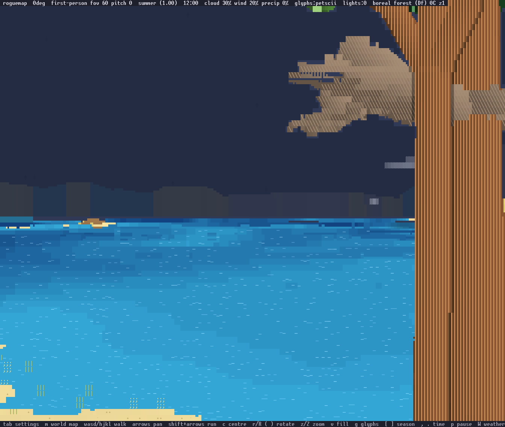

The open-sea shore with the walk to 300 m and the far tier to 4.6 km.
The coast at 1.6 km is a low strip near the sky's own tone, its skyline
stepping column by column, and it reads as a distant shore. Set beside
the marched and statistical frames above, it is the first of the three
that looks like distance rather than like a sampling artefact.

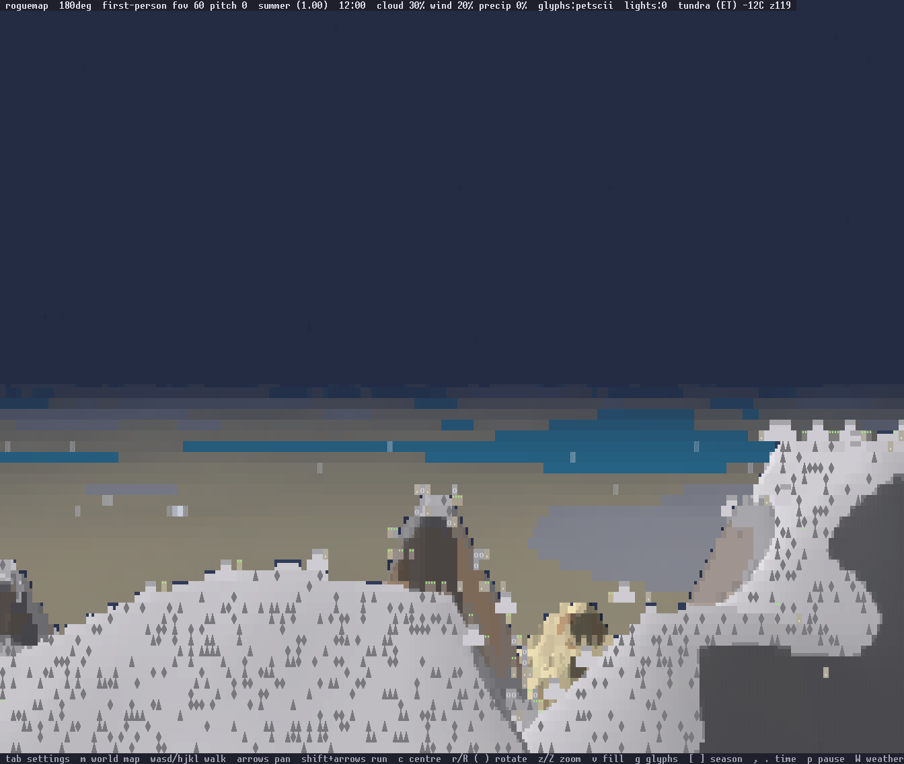

The level view from 121 m, walk to 300 m and the far tier to 40 km. The
horizon reads and the strips grade into the sky. What does not read is
everything the walk still draws: the middle tier is a churn of tan and
white, and the far tier's own lakes are hard blue slabs, because the
coarse field's 570 m period puts a feature across twenty columns at
2 km. Both faults are the terrain's frequency, which is the next
section.

The prototype is a prototype. The haze curve is a placeholder
exponential, the strips are not quantised into bands, and the sky's own
gradient — the fourth of the photograph's four constraints, and half of
why a horizon line reads — is not implemented at all.

### Why #36 comes first

Bands need ridgelines that survive to the horizon, and this world has
none. Issue #36 measures why: the terrain noise runs at a 44 m
wavelength against 120 m of relief, so the median land slope is 38
degrees and p90 is 65. A screen column is 0.0069 radians wide, which is
6.9 m of ground at 1 km, 27.5 m at 4 km and 275 m at 40 km, so a 44 m
feature falls under one column beyond 6.4 km and is a sixth of a column
where the level render marches. That is where the speckle comes from.
It is the field's, and the paragraph above this section attributed it to
the sampler before the measurement existed. The 167 m wavelength #36
proposes carries a feature to 24 km before it goes sub-column, and makes
it six columns wide at 4 km, which is what lets a ridgeline be a strip.

The far field cannot be built before #36 lands, and the far tier above
is what shows it. Its structure is right and its content is noise: the
strips grade into the sky as they should, and what they grade is a field
whose features are twenty columns wide at 2 km and a sixth of a column
at 40 km. A banded far field over this relief bands noise. Every render
in this section is of a world with no horizontal scale.

## 4. Where the term lives

The spike put it in the raster's terrain samplers, read from `Scene`.
The better home is the grid for what the grid holds and the far-field
sampler for what it does not: `HeightGrid::build` subtracts the sag per
tile as it copies `hf`, so `sample`, `hmax`, the block bases and the
tree bases all follow at no per-sample cost, and the pointwise far
field subtracts it at each sample. The one place that stays in the
raster is the sea: `SEA` is clamped in four places today and becomes a
field, `SEA - sag`, wherever it is read. The camera is the wrong place:
its rays are straight, and bending them would break the height form the
geometry tests take. No pass gains a parameter; `Scene` gains the
curvature and the tangent point, and `Camera::fog_origin` already names
the tangent point.

The tangent point is observer-relative and the frame recentres each
frame. Everything built in map space reads the sag through the grid, so
nothing built in map space goes wrong; the errors at range are the
term's own. The shadow mask sweeps twelve tiles: the differential sag
across a 24 m sweep at 4.5 km is 1.8 cm. The mask clamps its lookups to
its edge, so far terrain reads the edge cell's shadow, which is the
same wrong answer it gives today past the grid. A tree at the grid's
120 m edge floats 1.2 mm.

## 5. What breaks and what does not

The ADR-010 drafter's inventory of what assumes a plane, checked
against the code, with the curvature term's verdict on each:

| assumption | where | under the term |
|---|---|---|
| `z` is height above one plane; `p(z) = p0 + d z` | `Camera::project`, `unproject`, `ray`; the isometric walk | stands: `z` is height above the tangent plane and the sphere is inside the height function |
| the orthographic `Basis` has no depth term | `Camera` | stands |
| an upward ray is bounded by `grid.max_top`, a downward one by `FLOOR` | `Renderer::ray_march` | stands; the floor bound gains the sag at the far distance, which the spike did |
| height falls monotonically along a descending ray | the cloud fix's argument | stands: height above the plane is still linear along a ray |
| `HeightGrid` is a box of tiles, `Map` a rectangle with no wrap | `grid.rs`, `map.rs` | stands: the sandbox is a rectangle; beyond the grid the far field samples the map's own function, or the sea |
| `depth`, `tile_depth` sort by a dot with a constant yaw | `Camera` | stands |
| the shadow mask sweeps a constant sun | `shadow.rs` | stands: the sun's direction turns 0.04 degrees across 4.5 km |
| `CloudView` is a plane at constant altitude | `overlay.rs` | stands: a 4.5 km cloud is 1.7 m low against the sphere, under a row |

The whole list is avoided. What the term does not give is a closed
surface: walking round the planet, a planet-scale view, seams, poles.
Those are what a true sphere costs and the owner's reframing removed
them: the sandbox is a few kilometres, and the planet is where the
sandbox is.

The projection maths is surface-agnostic in both readings. The
vantage/projection split, the anchor, the reference distance and
`scale * distance = focal` are facts about straight rays in a Euclidean
frame; the term keeps the frame Euclidean, and even a true sphere keeps
the rays straight and changes only the surface they meet. What a true
sphere breaks is the walk's height parameterisation, the grid's box and
the sort's constant yaw. The camera work in flight is not at risk
either way.

What does change:

- `World::CLEAR_VISIBILITY` at 120 m becomes a few kilometres, and the
  fog fade over that range becomes an atmosphere, since a quadratic
  fade to sky over 4.6 km hides the coast at 1.6 km. The `fog=` handling
  in the snapshot already separates the far distance from the fade.
- The grid's reach and the far distance separate: `Scene.far` for the
  walk, a grid reach of about today's 120 m for geometry. Beyond the
  grid there are no trees and no blocks; a stand at 300 m is a green
  statistic.
- The perspective march's 4 m step cap goes, and the far field's
  samples come from a cached coarse lattice rather than pointwise
  noise.
- The sea level is a field wherever `SEA` is clamped today.
- `Renderer::terrain_hit` at range takes its face from a gradient the
  far field cannot afford; a far hit is a top face with a statistic's
  shade.
- The shadow mask and the colour cache are grid-indexed and clamp at
  the edge; far hits need an answer of their own, which is the sky's
  ambient and no cast shadow.
- The inset shares the `Scene` and so the main camera's tangent point;
  the inset follows the player, the main camera follows the player, and
  the sag across the inset's fifteen metres is under a micron.
- `view = island | filled` survives: an island's far field is sea to
  the horizon, a filled world's is the field; today an island's
  surroundings render as sky and would render as sea.
- The world map is a top-down plot of the sandbox and does not change.
- ADR-009's tilt: the tilted table at 1:8 spans 120 m by 200 m and the
  sag across it is 3 mm; the tilt floor of 30 degrees never looks along
  the ground, so the isometric view never sees a horizon and never
  needs the far field.
- Precision: a 10 km sandbox in `f32` has a spacing of 1 mm at its far
  edge (`ulp(10000) = 2^-10 m`), ADR-006's centimetres survive with
  three orders of margin, and the sandbox's place on the planet is a
  low-precision quantity. Rendering the flat world at `cx = 1e7` tiles
  would break, but nothing asks for it. No floating origin is needed.

## What gets simpler

Latitude, axial tilt and rotation as inputs to biome, season and the
sun are real and cheap: they are numbers the sandbox's place on the
planet gives `World`, and they replace the simulated equivalents with
derived ones. None of that is in this spike and none of it touches the
renderer. It is a `World` change with an asset row for the sandbox's
latitude.

## Grids

The Goldberg, cube-sphere and lat/lon question does not arise: the
sandbox is a rectangle on a tangent plane and issue #28's hex encounter
grid stays a local structure over it, as it was.

## Recommendation

Do it, as a constant and a fog distance rather than a renderer. That
much has held through three revisions of this section. What changed in
the third is the verdict's strength: the far tier is built and measured,
and a 40 km horizon costs 2.6 ms and one ray per screen column. A whole
frame with a horizon is 13.0 ms at 168x71 and 5.6 at 120x40, inside the
budget, where every per-cell far field in section 2 was over it.

The order moved twice on the way here. The measurements moved it once:
the far field's cost is the antialiaser before it is the march. The
owner's specification moved it again and further, and building it
settled two things the previous drafts left as expectations. The
antialiaser is not a cost to pay down — with a far tier it costs the
same as with no far field at all, and places 167 sextants that put the
skyline on a third of a row. Parallelising the walk is not needed for
this: a horizon fits one core. It stays in "Not settled" as a question
about the middle tier, which is now what dominates the frame.

In order:

1. Issue #36, the terrain's wavelength. A feature 44 m across is a sixth
   of a screen column at 4 km, and nothing built on top of that reads as
   landscape at any price.
2. The far distance and the grid reach as two numbers.
3. The step cap removed. It is the whole saving in samples, and it makes
   the frame's cost independent of the far distance.
4. The sag in the grid build and the far sampler, the sea as a field.
5. The far tier proper: the prototype's skyline and haze, plus the two
   parts it leaves out — strips quantised into bands, and the sky's own
   gradient palest at the horizon.
6. The middle tier's reach, which is now what sets the frame: 10.4 ms at
   120 m against 52.3 at 600 m, with no far tier in either.
7. The atmosphere over kilometres, which is the same work seen from the
   near side.

A per-cell statistic and a cached coarse lattice for it both leave the
list. A statistic answers a question — height at this cell — that a band
does not ask, and 168 marches a frame do not need a lattice.

A 500 m toy planet is a different game and a different renderer and is
not on this path.

## Not settled

- The far tier's own parameters. The prototype takes a haze scale and
  nothing else: how many strips, whether their boundaries come from
  ridgelines in the coarse field or from fixed distance rings, and
  whether a skyline per column wants smoothing across columns are all
  open, and the sky's gradient is not built.
- Where the middle tier should stop. It is what sets the frame now —
  10.4 ms at 120 m, 22.9 at 300 m, 52.3 at 600 m — and how far real
  geometry has to reach is a gameplay question this note cannot answer.
- Whether the model holds away from a sunset. The reference photograph
  puts the sun on the horizon, so its far ground is darker than its sky.
  The saturation and contrast collapse are the distance's; the luminance
  ordering is the sun's, and no midday reference was measured.
- Views from above the sandbox. The level view answers 121 m; from
  1,000 m the horizon is 110 km, and whether what is out there is a
  painted distance, the coarse field, or nothing but haze is open.
- What parallelising the walk buys for the middle tier. The horizon no
  longer needs it. A ray per cell is independent and the box has
  thirty-two threads; no frame here was rendered on more than one.
- Whether an eye at height looking level is a view the game offers at
  all. The spike's is first-person on a mountain, which is the only one
  this branch can build.
