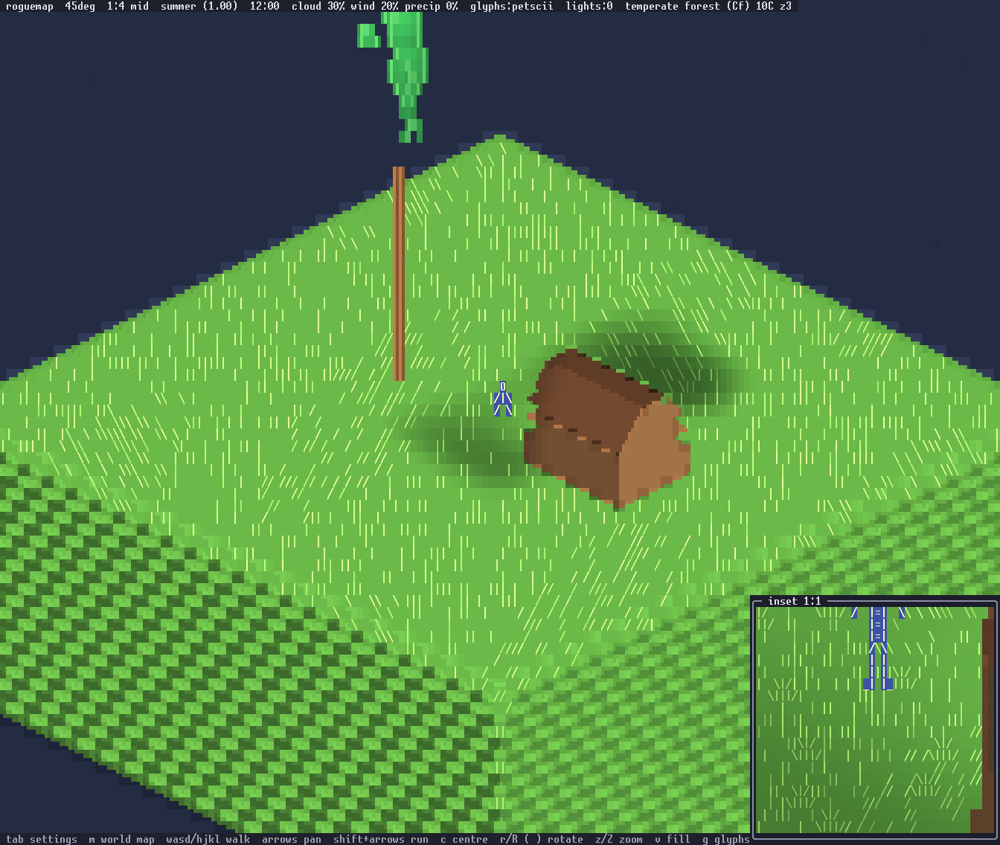

# Scale

The world is measured in metres. One number fixes everything else: a
person is 2 metres tall. A tile is 2 metres square, a house level is 3
metres, an oak is 18 metres, and every height, radius and reach in every
asset table is in metres. The decision is
[ADR-004](adr/ADR-004-world-scale.md); this page is the scale as the code
implements it.


The yardstick scene at 1:1: a 2 m person standing between an 18 m oak and
a house on flat ground. `make snap OUT=yard.png ARGS="scene=scale zoom=3
t=3 tod=12"` renders it, and `zoom=0` renders the same ground at 1:8.

## Units

World positions are `f32` metres. Anything stored discretely is
centimetres as `i32`, so the smallest unit in the world is a centimetre.

`src/map.rs` fixes the vertical band:

| Constant | Value | Meaning |
|---|---|---|
| `TILE_METRES` | 2.0 | a tile is 2 m by 2 m |
| `SEA` | 0 | sea level, the zero of the height scale |
| `FLOOR` | -12.0 | the deepest sea bed |
| `RELIEF` | 120.0 | the top of the tallest range |
| `STONE_Z` | 40 | bare stone shows above this height |
| `ROCK_Z` | 51 | rock is the ground terrain above this height |

So the whole vertical range of the world is 132 metres: 12 below the
waterline and 120 above it. A valley floor sits a metre or two above the
water and a range tops out at 120. A tile's gameplay height is the
continuous field floored to whole metres; the renderer uses the
continuous value.

The snow line and the treeline are not in that table and are not
constants: height cools the air by the lapse rate, the climate picks the
biome, and the biome's row says what grows and lies there. Snow is the
terrain wherever the tile is cold enough, and trees thin out because
tundra and ice cap carry almost no `tree_density` (docs/properties.md).

## The four zooms

Each zoom is a tile footprint in cells: a half width and a half height.
`src/tileset.rs` names them.

```rust
pub const ZOOMS: [(i32, i32); 4] = [(2, 1), (4, 1), (8, 2), (16, 4)];
pub const ZOOM_NAMES: [&str; 4] = ["far", "mid", "near", "close"];
pub const ZOOM_RATIOS: [&str; 4] = ["1:8", "1:4", "1:2", "1:1"];
```

Two numbers derived from the footprint carry the scale, and each is an
exact halving of the next:

| zoom | footprint | ratio | columns per metre | rows per metre | a 2 m person |
|---|---|---|---|---|---|
| close | 16x4 | 1:1 | 11.31 | 6 | 12 rows |
| near | 8x2 | 1:2 | 5.66 | 3 | 6 rows |
| mid | 4x1 | 1:4 | 2.83 | 1.5 | 3 rows |
| far | 2x1 | 1:8 | 1.41 | 0.75 | one glyph |

`Camera::columns_per_metre` is `hw * sqrt(2) / TILE_METRES`, the ground
scale that falls out of the isometric projection.
`camera::rows_per_metre_of` is `hw * 3.0 / 8.0`, chosen so the vertical
scale agrees with the horizontal one. Heights project through the second
rather than through one row per unit, which is what makes an 18 m oak 108
rows at 1:1 and 13 rows at 1:8, with the person standing under its
canopy.

`z` / `Z` step through the four. The status bar names the current one by
both its ratio and its name, so the top line reads `1:2 near`.

## Movement

One keypress moves the player one tile at every zoom. Because the zoom
changes how many cells a tile covers and not how big a tile is, that same
press is a whole block on screen at 1:1 and an eighth of one at 1:8. The
binding is `Action::Walk(dx, dy)` on `w a s d` and `h j k l`.

Shift with an arrow is `Action::Run(dx, dy)`: eight tiles, a stride at any
zoom. A plain arrow is `Action::Pan`, which slides the view by one tile
and leaves the player where they are; `c` recentres on the player.

The `Traversal` setting decides what a direction means.
`Camera::walk_step` either passes the pressed direction straight through
as map axes, or, in screen space, sends it through
`Camera::screen_dir_to_map` first, so that pressing `w` moves the figure
up the screen whatever angle the camera has been rotated to.

## Sprites at each scale

Billboards remain for the person, creatures and small props; everything
large is geometry. A sprite's art tiers are sized in metres and a tier is
drawn at the number of rows its height implies, so level of detail keys
off rows per metre rather than off the footprint. The player is a
twelve-row figure at 1:1, six at 1:2, three at 1:4, and a single `@` at
1:8. A sprite picks the tier whose row count is nearest what the thing
stands at that zoom, and stands with its feet on the ground.



The same yardstick at 1:4. The person is three rows and the oak's crown
is a volume rather than a grown model; what changes at each zoom is in
[rendering.md](rendering.md).

## The inset view

A second view always shows the other end of the scale. It is a second
`Camera` and `Renderer` over the same `Scene`, drawn into a frame in a
screen corner, and it follows the player rather than the main camera.

The bias rule is `Camera::inset_zoom`:

```rust
pub fn inset_zoom(main: usize) -> usize {
    let close = ZOOMS.len() - 1;
    if main % ZOOMS.len() == close { 0 } else { close }
}
```

While the main view is zoomed out at all — 1:2, 1:4 or 1:8 — the inset
shows 1:1. When the main view is already at 1:1, the inset shows 1:8. The
two views never share a level, so there is always a close reading and a
far one on screen at once.

The inset draws the scene alone: no HUD over it, and antialiasing and the
cloud layer off. Its title carries the ratio it is drawing at, so it reads
`inset 1:1`. It takes a quarter of the screen width and about three
tenths of its height, needs at least 20 by 8 cells, and is hidden below
100 columns. Because it follows the player and not the camera, panning
the main view leaves the inset where it was.

`n` toggles it. The `Inset` settings row places it in any of the four
corners or turns it off. Its row in `assets/ui.toml` ranks below the HUD
bars in priority, so it covers the tail of the line it sits on rather
than taking the whole line away; the frame system is in
[frames.md](frames.md).
