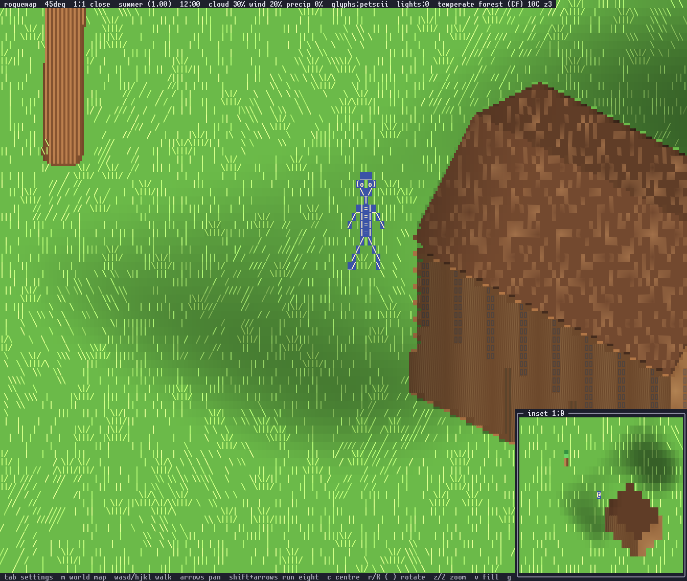

# Scale

The world is measured in metres. One number fixes everything else: a
person is 2 metres tall. A tile is 2 metres square, a house level is 3
metres, an oak is 18 metres, and every height, radius and reach in every
asset table is in metres. The decision is
[ADR-004](adr/ADR-004-world-scale.md); this page is the scale as the code
implements it.


The yardstick scene at 1:1: a 2 m person standing between an 18 m oak and
a house on flat ground. `make snap OUT=yard.png ARGS="scene=scale zoom=3
t=3 tod=12"` renders it, and `zoom=0` renders the same ground at 1:8.

## Units

World positions are `f32` metres. Anything stored discretely is
centimetres as `i32`, so the smallest unit in the world is a centimetre.

`src/map.rs` fixes the vertical band:

| Constant | Value | Meaning |
|---|---|---|
| `TILE_METRES` | 2.0 | a tile is 2 m by 2 m |
| `SEA` | 0 | sea level, the zero of the height scale |
| `FLOOR` | -12.0 | the deepest sea bed |
| `RELIEF` | 120.0 | the top of the tallest range |
| `STONE_Z` | 40 | bare stone shows above this height |
| `ROCK_Z` | 51 | rock is the ground terrain above this height |

So the whole vertical range of the world is 132 metres: 12 below the
waterline and 120 above it. A valley floor sits a metre or two above the
water and a range tops out at 120. A tile's gameplay height is the
continuous field floored to whole metres; the renderer uses the
continuous value.

The snow line and the treeline are not in that table and are not
constants: height cools the air by the lapse rate, the climate picks the
biome, and the biome's row says what grows and lies there. Snow is the
terrain wherever the tile is cold enough, and trees thin out because
tundra and ice cap carry almost no `tree_density` (docs/properties.md).

## The four zooms

Each zoom is a tile footprint in cells: a half width and a half height.
`src/tileset.rs` names them.

```rust
pub const ZOOMS: [(i32, i32); 4] = [(2, 1), (4, 1), (8, 2), (16, 4)];
pub const ZOOM_NAMES: [&str; 4] = ["far", "mid", "near", "close"];
pub const ZOOM_RATIOS: [&str; 4] = ["1:8", "1:4", "1:2", "1:1"];
```

Two numbers derived from the footprint carry the scale, and each is an
exact halving of the next:

| zoom | footprint | ratio | columns per metre | rows per metre | a 2 m person | pitch |
|---|---|---|---|---|---|---|
| close | 16x4 | 1:1 | 11.31 | 6 | 12 rows | 25.24 |
| near | 8x2 | 1:2 | 5.66 | 3 | 6 rows | 25.24 |
| mid | 4x1 | 1:4 | 2.83 | 1.5 | 3 rows | 25.24 |
| far | 2x1 | 1:8 | 1.41 | 0.75 | one glyph | 43.31 |

`Camera::isometric(zoom)` builds a preset. `Camera::columns_per_metre` is
`hw * sqrt(2) / TILE_METRES`, the ground scale that falls out of the
isometric projection. `Camera::rows_per_metre` is `hw * 3.0 / 8.0`, chosen
so the vertical scale agrees with the horizontal one. Heights project
through the second rather than through one row per unit, which is what
makes an 18 m oak 108 rows at 1:1 and 13 rows at 1:8, with the person
standing under its canopy.

The pitch is a number on the camera
([ADR-007](adr/ADR-007-general-camera.md)): a metre of ground depth
toward the camera is `hh * sqrt(2) / 2` rows and a metre of height
`3 hw / 8`, so the view is pitched `atan(4 sqrt(2) hh / (3 hw))` above
the horizon — 25.24 degrees for the three 4:1 footprints, a hair flatter
than the 26.57 of classic 2:1 pixel isometry, and 43.31 for the far
zoom's 2x1, which is the steeper view an overview wants and the only
footprint a 1:8 tile can have in whole cells.

`z` / `Z` step through the four. The status bar names the current one by
both its ratio and its name, so the top line reads `1:2 near`.

## The perspective modes

A perspective view has no footprint: its scale is the number of rows a
metre spans at the character's depth, `focal / 2 / depth * cos(pitch)`
with the focal length `(columns / 2) / tan(fov / 2)`, and every other
point takes the scale at its own depth
([rendering.md](rendering.md), "The eye"). On a 168x71 screen at the
presets' own fields of view that is about 5.3 rows per metre for the
chase view (a 2 m person 10 or 11 rows, as at 1:2), 5.8 for the shoulder
view, and 18 for the first-person view, which states its scale four
metres out, where whoever you face stands. The zoom preset nearest that
scale is what the frame carries for everything keyed by zoom, and the
inset takes the other end of the scale from it. `z` / `Z` halve and
double the chase distance instead of stepping footprints; the status
line reads `chase 12m fov 60 pitch 30`.

## Movement

The player's position is centimetres, `Entity::x_cm, y_cm`, and the tile
it stands in is derived from it
([ADR-006](adr/ADR-006-movement-by-screen-cell.md)). A keypress does not
move the figure; it joins the keys down, whose sum is a heading, and the
figure walks along it ([ADR-008](adr/ADR-008-walking.md)): every 40 ms
tick of the event loop the figure advances `speed * dt` metres along it,
`speed` being the creature row's metres per second — the person's 1.4 —
in whole centimetres with the fraction carried to the next tick, so the
distance walked is the speed times the time to the centimetre at every
zoom. The binding is `Action::Walk(dx, dy)` on `w a s d` and `h j k l`,
the four diagonals on `y u b n`; shift with an arrow or a capital
diagonal is `Action::Run(dx, dy)`, `World::RUN` = 3 times the speed.



The yardstick at 1:1 with the person 0.3 s into a walk to the right,
`make snap OUT=a.png ARGS="scene=scale zoom=3 t=3 tod=12 walk=d,0.3"`:
`walk=KEY,SECONDS` holds a walk key that long in the game's own ticks,
with `run=1` for the run speed, so a frame mid-stride is reproducible.

### The keys down

The heading is the normalised sum of the direction keys down,
`Camera::held_heading`, each key counting as the unit heading of each
axis it names. So `w` and `d` together walk the diagonal half way between
them, `w` and `s` cancel to no walk at all, and a diagonal key is exactly
the two keys it stands for. Any key down pressed with shift makes the
whole walk a run. Letting the last one up stops the figure on that tick,
`World::stop_walk`, rather than after the grace, and a frame taking focus
lifts them all, so the figure stands still under a popover.

Whether two keys can be down at once is the terminal's to say, and the
status bar names which of the two modes the session is in.

`keys:held`. A terminal that speaks the keyboard enhancement protocol —
Konsole, kitty, foot, WezTerm, Alacritty — reports releases, so the game
asks for them at startup, `Terminal::with_key_release`. It pushes
`DISAMBIGUATE_ESCAPE_CODES`, `REPORT_EVENT_TYPES`,
`REPORT_ALTERNATE_KEYS` and `REPORT_ALL_KEYS_AS_ESCAPE_CODES`: the
release and repeat events are the point, a plain-text key is only
reported at all three event types once every key comes as an escape code,
and the alternate keycode is what keeps a shifted letter arriving as its
capital. The flags are popped on the way out and in the panic hook. A key
is then down from its press until its release, so any number of them are
down at once and a chord is a diagonal.

`keys:repeat`. A terminal that reports no releases delivers a press, its
repeat delay, and then a press per repeat interval — 40 ms on a typical
desktop — and while two keys are held it repeats only the last pressed.
So each key instead holds a lease of `World::GRACE` = 0.1 s that every
press or repeat renews and every tick spends, the last tick cut to what
is left: a tap walks exactly 14 cm over three ticks, a held key is a
steady walk that stops within three ticks of the release, and two keys
alternated stay live together and walk the diagonal as well as the
terminal can deliver it. A held chord cannot be delivered at all, which
is what `y u b n` are for. The pause between the first press and the
first repeat is the terminal's repeat delay and shows as a short hitch;
the lease is not stretched over it, since that would make every release
late.

### The mouse

The game captures the mouse, and the `Mouse` settings row says what the
pointer does: `drag`, the default, turns the view while a button is held;
`free` turns it on any motion, which is the first-person feel the owner
asked for; `off` ignores it. A terminal reports the cell the pointer is
in, so a turn is the cells moved times `Mouse::YAW_PER_COLUMN` = 2
degrees of yaw a column and `Mouse::PITCH_PER_ROW` = 3 degrees of pitch a
row — a row is worth more because a cell is twice as tall as it is wide.
Moving right turns right and moving down looks down, through
`Camera::rotate_by` and `Camera::pitch_by`; the isometric view has no
pitch of its own, so rows do nothing there. The wheel narrows and widens
a perspective view's field of view and steps the isometric zoom.

A terminal has no pointer lock, so in `free` the turn stops when the
pointer reaches the edge of the screen: lift the mouse and put it back
down in the middle, as at the edge of a mousepad. Motion with no button
held is its own reporting mode (1003) that Konsole and kitty send and
some terminals do not; where it is missing, `drag` still works. While a
frame has focus the pointer does not turn the view, and where it was is
forgotten, so the first motion after the frame closes is a fresh start
and not a jump. The terminal's own selection needs shift while the game
is running.

In a first-person or chase view the walk keys already follow the view: a
screen-space heading is taken from the camera's own axes, so `w` walks
away from the eye along whatever yaw the mouse has turned to.

While the figure walks, its art cycles through the poses the tier
carries (docs/assets.md): the pose is picked by distance walked on this
walk through a stride of `World::STRIDE` = 0.7 m, so `n` poses hold
`0.7 / n` metres each and a run cycles three times faster. Stopping
returns the figure to its rest pose. The figure faces its direction of
travel: the heading sets `Entity::facing` from its screen-space sign,
left or right, keeps the last facing when the heading is
straight toward or away from the camera, and the facing persists when
stopped; a figure facing left is the art's mirror. The figure's feet are
drawn at the exact point, at `Map::ground_at`; on a slope the rise or
fall of the ground shows on top of the distance walked.

The camera follows with give: `Camera::follow` runs once a tick and
closes `Camera::EASE` = 0.3 of what is left toward the figure. In the
isometric mode the figure has a dead zone, the middle third of the screen
each way, inside which the view does not move, so a few steps do not
scroll the ground; outside it the offset eases by whole cells, never less
than one while any remains, until the figure is back inside, so a long
walk scrolls the ground steadily with the figure held near the zone's
edge. The ease runs only while a walk is settling, so a plain arrow,
`Action::Pan`, still slides the view by one tile and leaves it there; `c`
recentres on the player in one jump. The chase and shoulder views ease
the aimed point toward the character; the first-person view is the
character's eye and snaps.

Collision is per tile: `World::try_move` refuses a step when the tile
the new point falls in is off the map or not in the creature's
`can_enter`, so the walk stops at the pond's edge, within a step of it,
and a diagonal walk into a shore slides along it, since a step refused
as a whole is tried along each axis alone.

The `Traversal` setting decides what a direction means. In screen space
a press walks the figure that way on screen, `Camera::heading`: a
diagonal in map space at the compass view, turning with the camera, and
forward or sideways from an eye. Along the map axes the heading is the
axis the key names.

The ground under a screen cell at each zoom is still the camera's to
say, `Camera::cell_step`, which the snapshot's `player_dx` and
`player_dy` (centimetres, through the same `try_move`) and the ADR-006
tests use:

| zoom | one column | one row |
|---|---|---|
| close 1:1 | 8.8 cm | 35.4 cm |
| near 1:2 | 17.7 cm | 70.7 cm |
| mid 1:4 | 35.4 cm | 141.4 cm |
| far 1:8 | 70.7 cm | 141.4 cm |

Those are `TILE_CM / (hw * √2)` for a column and `TILE_CM / (hh * √2)`
for a row; far and mid share a half height of one and so a row. At 1:1
the figure walks about two thirds of a column a tick and at 1:8 two
columns a second, so the same walk is a stride on screen up close and a
crawl across the overview.

## Sprites at each scale

Billboards remain for the person, creatures and small props; everything
large is geometry. A sprite's art tiers are sized in metres and a tier is
drawn at the number of rows its height implies, so level of detail keys
off rows per metre rather than off the footprint. The player is a
twelve-row figure at 1:1, six at 1:2, three at 1:4, and a single `@` at
1:8. A sprite picks the tier whose row count is nearest what the thing
stands at that zoom, and stands with its feet on the ground. From an eye
it picks by the rows a metre is worth at its own depth, so a creature
far down a first-person view is a glyph and one beside you the twelve-row
figure; the first-person view's own character is the eye and is not
drawn.


The same yardstick at 1:4. The person is three rows and the oak is its
grown model at the coarse level of detail; what changes at each zoom is
in [rendering.md](rendering.md).

## The inset view

A second view always shows the other end of the scale. It is a second
`Camera` and `Renderer` over the same `Scene`, drawn into a frame in a
screen corner, and it follows the player rather than the main camera.

The bias rule is `Camera::inset_zoom`:

```rust
pub fn inset_zoom(main: usize) -> usize {
    let close = ZOOMS.len() - 1;
    if main % ZOOMS.len() == close { 0 } else { close }
}
```

While the main view is zoomed out at all — 1:2, 1:4 or 1:8 — the inset
shows 1:1. When the main view is already at 1:1, the inset shows 1:8. The
two views never share a level, so there is always a close reading and a
far one on screen at once. A perspective view's inset is the isometric
view at the other end from the preset nearest its scale: 1:8 beside the
first-person view, 1:1 beside a chase view zoomed out.

The inset draws the scene alone: no HUD over it, and antialiasing and the
cloud layer off. Its title carries the ratio it is drawing at, so it reads
`inset 1:1`. It takes a quarter of the screen width and about three
tenths of its height, needs at least 20 by 8 cells, and is hidden below
100 columns. Because it follows the player and not the camera, panning
the main view leaves the inset where it was.

`x` toggles it. The `Inset` settings row places it in any of the four
corners or turns it off. Its row in `assets/ui.toml` ranks below the HUD
bars in priority, so it covers the tail of the line it sits on rather
than taking the whole line away; the frame system is in
[frames.md](frames.md).
