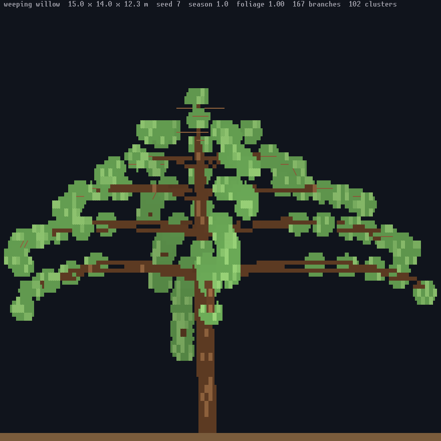

# Trees

Every tree in the world is grown from a grammar. A species names a growth
habit, the habit is a parametric L-system, and the grammar produces a
model of branch capsules and leaf clusters that the ray walk tests
directly. The grammar itself — its alphabet, its rules and its templates —
is in [lsystem.md](lsystem.md); this page is the habits, their parameters
and how a species becomes a tree in the world.


A gnarled oak, seed 7, in summer. `make tree-snap OUT=oak.png NAME="gnarled
oak" ARGS="110 55 7 1"` renders it.

## The eight habits

`assets/tree_styles.toml` holds eight growth habits. Each names the canopy
volume it stands in as when it is too far away to grow, and carries a
parameter set and a rule set.

| Habit | Stand-in | Shape |
|---|---|---|
| `excurrent` | cone | One straight leader that keeps growing, a whorl of near-horizontal branches at every tier, tiers shortening upward. Spruce, fir, most conifers. |
| `decurrent` | ellipsoid | A trunk that forks low into spreading limbs, each forking again. Broad, rounded, and it holds its shape bare. Oak, maple. |
| `columnar` | ellipsoid | One slender leader with short side shoots that stay close to it. A young birch, a poplar, a cypress. |
| `weeping` | dome | Limbs that arch up and out from a low crotch and then hang, so the tree reads as a curtain. A weeping willow. |
| `umbrella` | ellipsoid | A tall clean trunk ending in one whorl of limbs branching flat and wide. An acacia, an old pine. |
| `vase` | ellipsoid | Limbs fanning up and out from a short trunk with no leader, widening as they rise. An elm, an old apple. |
| `palm` | ellipsoid | One unbranched stem carrying a crown of arching fronds at its head, nothing below. A palm, a tree fern. |
| `shrub` | dome | Many stems from the ground with no trunk between them, each dividing into a low rounded mass. A hazel thicket, a juniper. |


A spruce from the `excurrent` habit. Its rule emits two whorls per
rewriting with a taper between them, so a mature tree carries a tier about
every metre and a half rather than one every two or three, and the tiers
narrow into a spire. The grey tier under the green ones is a shed whorl:
see `dead_whorls` below.

## Parameters

A habit's `[style.params]` carries thirteen numbers. A species overrides
the ones it wants different.

| Parameter | Range | What it does |
|---|---|---|
| `branch_angle` | 0..180 degrees | the turn every `+ - & ^` symbol makes |
| `forks` | ≥ 1 | branches per whorl or fork |
| `taper` | 0.1..1 | how much a branch shortens and thins past its parent |
| `droop` | -1..1 | fraction of the branch angle each segment bends toward the ground; negative lifts |
| `leaf_density` | 0..1 | probability an `L` becomes a cluster, and the stand-in's porosity and shadow opacity |
| `asymmetry` | 0..1 | how far the tree leans and favours one side |
| `jitter` | 0..1 | how much each branch's angle and length wander |
| `prune_height` | 0..1 | fraction of the tree's height below which branches are dropped |
| `dead_whorls` | 0..8 | how many of the lowest whorls left standing are dead: bare grey branches, no foliage |
| `depth` | ≤ 12 | rewriting generations |
| `length` | > 0 | the first segment's length |
| `leaf_radius` | ≥ 0 | the radius of one leaf cluster |
| `leaf_flat` | 0..1 | how flat a cluster on a level branch is; 0 keeps every cluster round |

**Asymmetry** picks a seeded compass bearing, tilts the whole turtle frame
up to twelve degrees toward it, and then lengthens limbs that face that
way by up to half while shortening the far side. It is what makes the
gnarled oak lean.

**Jitter** nudges each branch's heading by a fraction of the branch angle,
scales its length by up to ±40 percent of the jitter, and scatters leaf
clusters. It moves branches; it never adds any.

**Prune height** is a fraction of the grown tree's measured height, capped
at 0.95. The word is walked twice: once to measure, once with the cut in
place, dropping any bracketed branch that starts below it. If pruning
would leave a bare pole, the unpruned tree is kept instead.

**Dead whorls** are the shed tier or two a conifer carries between the
bare trunk and the live crown. Where prune height drops the branches
below the cut, this keeps them and kills them: the limbs that leave the
bole at the lowest surviving heights lose their leaf clusters and take
the grey bark of a snag, and the leader's own clusters below the lowest
live whorl go with them, since the crown starts where the live limbs do.
The count is a fraction, and each tree rounds it up or down from its own
seed, so a stand carries both one shed whorl and two; the last whorl is
never shed, so a sapling of few tiers keeps its crown.

**Leaf density** does two jobs. In the grammar it decides which `L`
symbols become clusters, and that is the grown crown's porosity: a
cluster is solid, and the holes in a crown are the gaps the grammar left
between them. In the renderer it is the stand-in's porosity — a ray
inside a stand-in canopy meets foliage with that probability and
otherwise passes through — and the crown's opacity in the shadow mask, so
a thin tree throws a light shadow.

**Leaf flatness** squashes a cluster by how level the branch it sits on
is: a cluster on a horizontal branch keeps `1 - leaf_flat` of its height,
one on an upright leader keeps all of it. Needles on a whorl branch are a
spray rather than a ball, so `excurrent` carries 0.5 and its tiers read as
tiers with gaps between them; the other habits keep their clusters round.

Here is the whole parameter set of the `excurrent` habit:

```toml
[style.params]
branch_angle = 20.0
forks = 5
taper = 0.94
droop = 0.14
leaf_density = 0.85
asymmetry = 0.08
jitter = 0.1
prune_height = 0.18
dead_whorls = 1.5
depth = 10
length = 1.0
leaf_radius = 0.85
leaf_flat = 0.5
```

`excurrent` and `palm` carry a leaf density of 0.85, `shrub` 0.8, and the
other five 0.7. A species that writes its own grammar with no habit falls
back to a plain set with leaf density 1.0, jitter 0.08 and no asymmetry,
droop or pruning.

## Species

A species names its habit with `style` and its shape with `shape =
"lsystem"`. The two imply each other: a habit without that shape is a load
error, and that shape without either a habit or a full grammar of its own
is too.

```toml
[[species]]
name = "spruce"
form = "pine"
size_class = "large"
size = [7.0, 7.0, 25.0]
shape = "lsystem"
style = "excurrent"
trunk_radius = 0.3
canopy = [22, 72, 46]
canopy_glyph = [56, 118, 74]
```

`size` is a mature tree's spread and height in metres, and the grown model
is fitted to it. `size_class` scales the species — small 0.8, mixed 1,
large 1.15 — and the tile's variant scales each tree again between 0.8 and
1.1. On top of that every instance takes its own height and crown radius a
quarter either way from its tile's seed, and a canopy a sixth brighter or
dimmer and slightly warmer or cooler. That is what keeps a stand from
reading as one repeated model; what keeps it from reading as one canopy is
the seam outline described under "The stand-in rule".

## Seasons

Season is a continuous number in 0 to 4: spring, summer, autumn, winter.
A species with a four-colour canopy sheds; one with a single colour is
evergreen. A shedding species carries foliage equal to `vigour`, which
smoothsteps the seasonal temperature between −5 and 7 degrees, and the
seasonal temperature swings ±9 degrees about the annual figure, peaking at
summer and bottoming at winter.

Foliage scales the leaf cluster radius. Below 0.05 the tree is drawn bare:
the last few leaves of autumn are a bare tree, and every twig shows.


The same gnarled oak at season 3. The crown is gone and the limb structure
the `decurrent` habit grew is what is left.

## Dead trees

A living tree carries deadwood too, in the whorls `dead_whorls` sheds:
they take the same grey bark, one branch at a time rather than the whole
model.

Each species carries a `dead_chance`, 0.02 by default. A tile's seed
decides whether the tree standing on it is a snag. A dead tree grows from
the habit's `dead_rules` at the same depth, or from its live rules one
generation shallower if it has none, so a snag keeps the skeleton of its
habit with the fine structure gone. It carries no foliage at any season,
its wood is greyed toward a bone colour, and it still casts, at 0.45
opacity rather than its leaf density.

```
make tree-snap OUT=snag.png NAME="gnarled oak" ARGS="110 55 7 1 state=dead"
```

## The side-view preview

One species, side on, at whatever seed and season you ask for:

```
roguemap --snap-tree NAME OUT.cells [cols rows seed season] [foliage=F] [state=dead]
```

The four positional arguments default to 120, 60, seed 7 and season 1, and
each also has a keyword form — `cols=`, `rows=`, `seed=`, `season=` — which
wins over the positional. `foliage=F` overrides what the season would give.
`state=dead` grows the snag.

`./tree-snap.sh out.png NAME ...` wraps it into a PNG, and `make tree-snap`
wraps that. The header line names the species, its fitted size in metres,
the seed, the season, the foliage or `dead`, and the branch and cluster
counts of the model.



The `weeping` habit at a droop of 0.42, with its leaf density thinned so
the limbs inside the curtain still read.

## The stand-in rule

Growing a tree is worth it wherever you can see its shape, which is every
zoom but the overview. Four tiers, keyed on rows per metre:

| zoom | rows per metre | what a tree is |
|---|---|---|
| far 1:8 | 0.75 | a one-glyph billboard from `art/tiny` |
| mid 1:4 | 1.5 | the grown model, simplified to a coarse level: a 25 m spruce is 37 rows, and its spire and tiers read |
| near 1:2 | 3 | the grown model: branch capsules and leaf clusters |
| close 1:1 | 6 | the same, simplified less |

There is no distance threshold and no tree count in the rule. At every
zoom that grows a model the habit's `stand_in` volume is still built, but
marked so the walk never meets it: it survives because it is what the
shadow mask sweeps and what the chunk ceiling bounds, and stamping a
hundred thousand primitives would cost more than the frame. The walk only
meets a stand-in where a species has no grammar at all.


The boreal stand at 1:4: tiered spires with their own outlines, trunks in
the gaps, the same trees the two nearer zooms draw.

What the walk tests is the model at the size it is drawn.
`TreeModel::simplify` takes a lattice about four rows of height across,
centred on the trunk, and merges the leaf clusters of each cell into one:
at its members' centroid, no wider on any axis than the box they fill and
covering no more of the screen than they would side by side, so a crown
keeps the lumps its leaves grew in instead of swelling into the lattice.
Branches thinner than about one column are dropped, because the foliage
that grew on them covers them, except the bole: the chain of segments from
the foot, followed as far as it stays six tenths of its own width, is
kept at every zoom and joined into capsules of up to two cells of rise, so
a thin-trunked spruce keeps its trunk at 1:4. A bare or dead tree keeps
its twigs down to a third of that cut, since the twigs are all there is of
it; the finest ones, thinner than a third of a column, only cost the walk.

Each cluster is solid. The holes in a grown crown are the gaps the grammar
left between its clusters, which is what lets sky and ground show between
the tiers of a spruce and through a bare oak; the stand-in's porosity is
for a species with no grammar.

A stand reads as trees rather than as one canopy because each tree is set
apart from its neighbours twice. Its canopy tint is its own, a sixth
brighter or dimmer and warmer or cooler from its tile's seed. And where
one tree stands in front of another, the cells of the tree behind along
the seam are darkened by a third, so every crown carries an outline
against the crowns behind it; crown seams are never supersampled, so this
is the only thing that separates two crowns of one species in the same
light.

A grown model is cached by species, tile seed, foliage quantised to nine
steps, dead or alive, and detail level. It lives four frames past the last
frame that wanted it, and the cache holds three thousand.


The same stand at 1:2, each spruce grown from the `excurrent` habit with
its own seed. Spacing keeps trunks and gaps between the crowns: a species
stands its trees three quarters of a crown width apart by default, times
the biome's own factor, which is 0.4 where crowns interlock and 2 in a
savanna.
